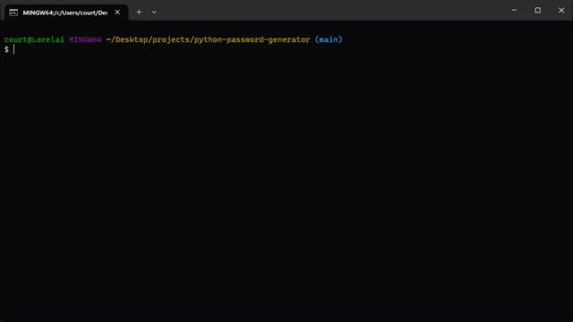

# password-generator

This script generates a shuffled password with two random uppercase characters, two random lowercase characters, 2 random numbers, and 2 random special characters.

## Excution

This project uses python and is excuted in the terminal.

